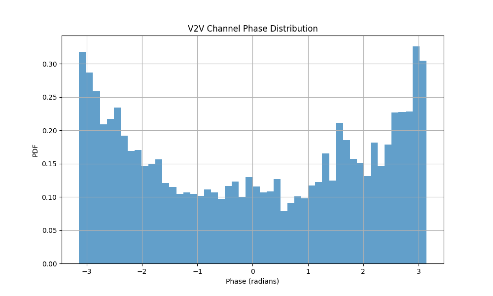
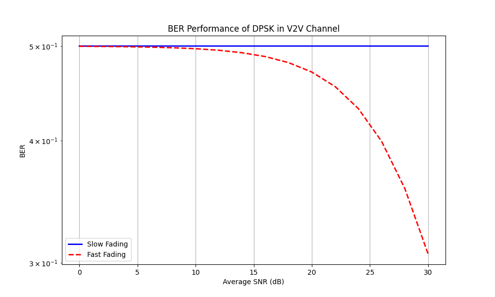

# Analysis and Simulation of Vehicle to Vehicle Fading Channels

This repository contains a Python implementation of a Vehicle-to-Vehicle (V2V) fading channel simulator. The simulation models the statistical properties of V2V communication channels, including envelope distribution, power gain distribution, autocorrelation, phase distribution, and bit error rate (BER) performance.

## Description

The simulator implements a sum-of-sinusoids method to generate Gaussian processes that model V2V fading channels. It considers both transmitter and receiver mobility, making it suitable for analyzing mobile-to-mobile communication scenarios. The implementation includes:

- Generation of complex Gaussian processes using the sum-of-sinusoids method
- Calculation and visualization of channel envelope and power gain distributions
- Analysis of autocorrelation functions
- Phase distribution analysis
- BER performance evaluation for DPSK modulation under different fading conditions

## Requirements

To run this simulation, you need:

```
Python 3.7+
NumPy
SciPy
Matplotlib
```

You can install the required packages using pip:

```bash
pip install numpy scipy matplotlib
```

## Usage

1. Clone this repository:
```bash
git clone https://github.com/Saifgharbii/Analysis-and-Simulation-of-Vehicle-to-Vehicle-Fading-Channels

```

2. Run the simulation script:
```bash
python v2v_channel_simulation.py
```

## Simulation Parameters

The main simulation parameters can be adjusted in the code:

- `N1, N2, N3, N4`: Number of sinusoids (default: 8)
- `fmax_Tx, fmax_Rx`: Maximum Doppler frequencies in Hz (default: 80 Hz)
- `sigma1, sigma2`: Standard deviations of the Gaussian processes (default: 1.0)
- `Ts`: Sampling time (default: 0.0001 seconds)
- `D`: Data rate for BER calculation (default: 1 Mb/s)

## Output Plots

The simulation generates several plots:

1. **Gaussian Process Distribution**: Validates the Gaussian nature of the generated processes
2. **Envelope Distribution**: Shows the distribution of the channel envelope
3. **Power Gain Distribution**: Displays the distribution of channel power gain
4. **Autocorrelation Function**: Compares simulated and theoretical autocorrelation
5. **Phase Distribution**: Shows the distribution of channel phase
6. **BER Performance**: Compares BER under slow and fast fading conditions

## Mathematical Models

The simulation implements several theoretical models:

### Envelope PDF
```python
PDF(z) = (4z)/(σ₁²σ₂²) * K₀(2z/(σ₁σ₂))
```
where K₀ is the modified Bessel function of the second kind of order zero.

### Power Gain PDF
```python
PDF(w) = 2/(σ₁²σ₂²) * K₀(2√w/(σ₁σ₂))
```

### Autocorrelation Function
```python
ACF(τ) = J₀(2πfₘₐₓτ)
```
where J₀ is the zero-order Bessel function of the first kind.

# Vehicle-to-Vehicle (V2V) Fading Channel Simulation

## Results

The simulation generates several plots that demonstrate different aspects of the V2V fading channel characteristics. Here are the detailed results and their interpretations:

### 1. Gaussian Process Distribution


This plot validates the Gaussian nature of our generated processes. The histogram of the simulated samples (blue) closely follows the theoretical Gaussian distribution (red line), confirming that our sum-of-sinusoids method correctly generates Gaussian random processes. The close match between theoretical and simulated distributions indicates the accuracy of our channel modeling approach.

### 2. Envelope Distribution


The envelope distribution plot shows the probability density function (PDF) of the channel envelope. The simulated histogram matches the theoretical double-Rayleigh distribution, which is characteristic of V2V channels. This distribution arises from the product of two complex Gaussian processes, representing the cascaded fading effect between the transmitter and receiver vehicles. The good agreement between theoretical and simulated results validates our implementation.

### 3. Power Gain Distribution


This plot displays the distribution of the channel power gain (Ω = R²), where R is the envelope amplitude. The power gain distribution is particularly important for link budget calculations and fade margin determination in V2V communications. The theoretical curve shows the expected distribution derived from the double-Rayleigh model, while the histogram represents our simulation results.

### 4. Autocorrelation Function


The autocorrelation function (ACF) plot demonstrates the temporal correlation properties of the channel. The simulated ACF (solid line) is compared with the theoretical Bessel function (dashed line). This correlation structure is crucial for understanding the time-varying nature of the channel and its impact on system performance. The plot shows how quickly the channel decorrelates over time, which is essential for determining parameters like coherence time and interleaver design.

### 5. Phase Distribution


The phase distribution plot shows the statistical properties of the channel phase variations. In V2V channels, the phase is expected to be uniformly distributed over [-π, π]. This uniform distribution is a result of the random scattering environment between the transmitter and receiver vehicles. The histogram demonstrates this uniform characteristic, which is important for analyzing phase-dependent modulation schemes.

### 6. BER Performance


This plot compares the Bit Error Rate (BER) performance under slow and fast fading conditions for DPSK modulation. The blue line represents slow fading scenarios (low vehicle speeds or low Doppler spread), while the red dashed line shows fast fading conditions (high vehicle speeds or high Doppler spread). The degradation in performance under fast fading is clearly visible, demonstrating the impact of mobility on communication reliability. This analysis is crucial for designing robust V2V communication systems and selecting appropriate modulation schemes.


## Contributing

Contributions to improve the simulation are welcome. Please follow these steps:

1. Fork the repository
2. Create a new branch
3. Make your changes
4. Submit a pull request

## License

This project is licensed under the MIT License - see the LICENSE file for details.
