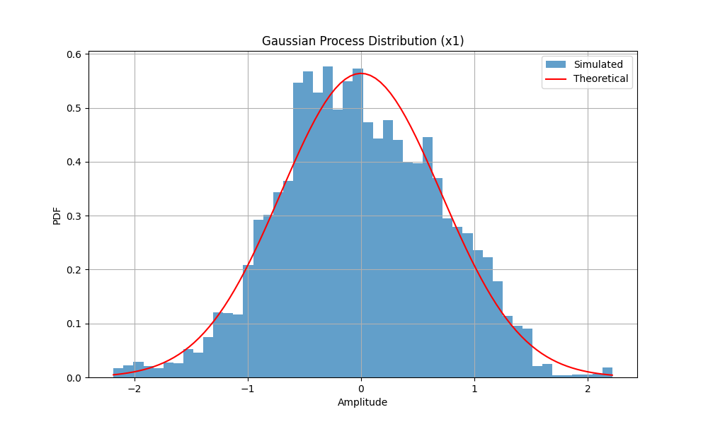
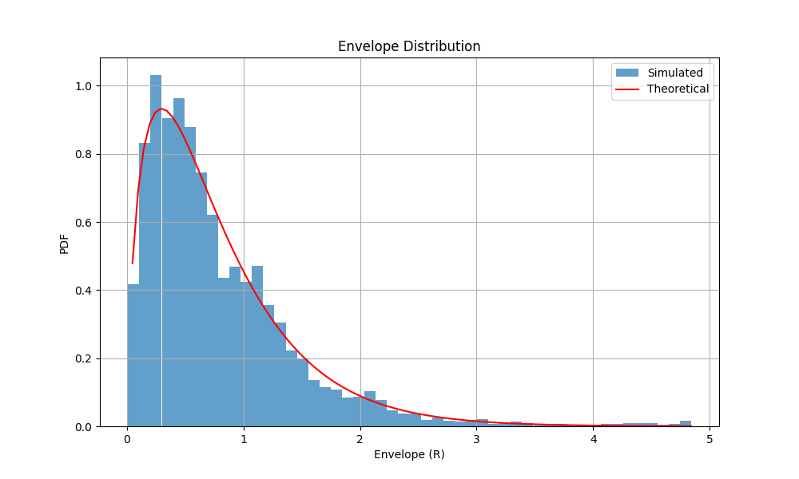
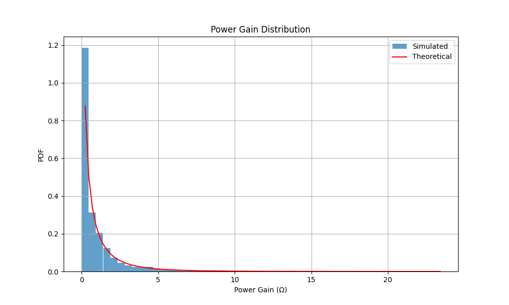

# Analysis and Simulation of Vehicle to Vehicle Fading Channels

This repository contains a Python implementation for simulating and analyzing Vehicle-to-Vehicle (V2V) fading channels in Rayleigh fading environments. The simulation includes generation of complex Gaussian processes, calculation of channel statistics, and visualization of various channel characteristics.

## Authors
- Saif Iddin Gharbi
- Mouhamed Amine Trabelsi
- Amal Madhi
- Sirine Charrada
- Chiheb El Din El Zidi

## Requirements

### Dependencies
```
numpy >= 1.21.0
scipy >= 1.7.0
matplotlib >= 3.4.0
```

### Installation
1. Clone this repository:
```bash
git clone https://github.com/Saifgharbii/Analysis-and-Simulation-of-Vehicle-to-Vehicle-Fading-Channels.git
cd v2v-channel-simulation
```

2. Install required packages:
```bash
pip install numpy scipy matplotlib
```

## Features

The simulation implements the following key features:

1. **Gaussian Process Generation**
   The system uses a sum-of-sinusoids method that forms the foundation of the simulation. This implementation allows for configurable number of sinusoids to adjust the accuracy and complexity of the model. Users can also adjust Doppler frequencies to match specific vehicular scenarios and movement patterns.

2. **Channel Characteristics Analysis**
   The simulation calculates complex channel gains to model the V2V communication path. It analyses both envelope and power gain distributions to understand signal strength variations. The system also includes phase distribution analysis to track signal phase changes over time. Additionally, it computes the autocorrelation function to understand the temporal correlation of the channel.

3. **Statistical Verification**
   The Statistical Verification features ensure the accuracy of the simulation results. It compares theoretical and simulated probability density functions (PDFs) to validate the model's statistical properties. The system performs autocorrelation function validation to verify the temporal characteristics of the channel. It also analyses channel parameter distributions to ensure they match theoretical expectations.

## Code Structure

- `generate_gaussian_process()`: Generates Gaussian processes using sum-of-sinusoids
- `theoretical_envelope_pdf()`: Calculates theoretical envelope PDF
- `theoretical_power_pdf()`: Calculates theoretical power gain PDF
- `theoretical_acf()`: Computes theoretical autocorrelation function

## Usage

Run the simulation script:
```bash
python v2v_simulation.py
```

The script will generate several plots showing:
- Gaussian process distribution
- Envelope distribution
- Power gain distribution
- Autocorrelation function comparison
- Channel phase distribution

## Simulation Parameters

Default parameters in the code:
- Number of sinusoids (N): 8
- Maximum Doppler frequency: 80 Hz
- Standard deviations (σ₁, σ₂): 1.0
- Sampling time (Ts): 0.0001 s
- Simulation duration: 1 s

These parameters can be modified in the code according to specific needs.

## Example Results

### Gaussian Process Distribution

	The Gaussian Process Distribution graph displays how the generated Gaussian process behaves over time. This visualization allows users to verify that the generated random processes follow the expected normal distribution, providing a fundamental validation of the simulation's core functionality.

### Envelope Distribution

	The Envelope Distribution visualization shows the probability density function of the signal envelope. This graph demonstrates how well the simulated results align with theoretical predictions, offering crucial validation of the channel model's amplitude characteristics.

### Power Gain Distribution

	The Power Gain Distribution plot illustrates how the channel's power gain varies across the simulation. This visualization helps users understand the signal strength fluctuations and verify that they follow expected theoretical patterns for V2V communications.

### Autocorrelation Function

	The Autocorrelation Function comparison demonstrates the temporal correlation properties of the simulated channel. By comparing simulated results with theoretical expectations, this visualization validates that the channel's time-varying characteristics are accurately modeled.

## Technical Details

The simulation is based on the following channel model:

1. **Complex Channel Gain**:
   ```
   h = h₁h₂ = (x₁ + jy₁)(x₂ + jy₂)
   ```
   where xᵢ, yᵢ are independent Gaussian random variables

2. **Envelope PDF**:
   ```
   pR(z) = (4z)/(σ₁²σ₂²)K₀(2z/(σ₁σ₂))
   ```
   where K₀ is the modified Bessel function

3. **Autocorrelation Function**:
   ```
   Γxx(τ) = Γyy(τ) = (σ₁²σ₂²/2)J₀(2πfmax,Txτ)J₀(2πfmax,Rxτ)
   ```

## Contributing

Contributions to improve the simulation are welcome. Please follow these steps:
1. Fork the repository
2. Create a new branch
3. Make your changes
4. Submit a pull request

## License

This project is licensed under the MIT License - see the LICENSE file for details.

