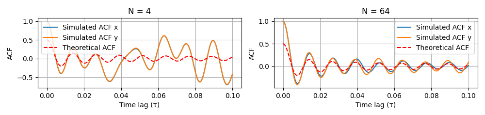

# Vehicle-to-Vehicle (V2V) Fading Channel Simulation

This project implements a comprehensive simulation of Vehicle-to-Vehicle (V2V) fading channels using the sum of sinusoids method. It analyzes various channel characteristics including Gaussian processes, autocorrelation functions, envelope distributions, and BER performance under different fading conditions.

## Authors

- Saif Iddin Gharbi
- Mouhamed Amine Trabelsi
- Amal Madhi
- Sirine Charrada
- Chiheb El Din El Zidi

## Requirements

To run this simulation, you'll need:

- Python 3.7+
- NumPy
- SciPy
- Matplotlib

You can install the required packages using pip:

```bash
pip install numpy scipy matplotlib
```

## Features

The simulator implements a sum-of-sinusoids method to generate Gaussian processes that model V2V fading channels. It considers both transmitter and receiver mobility, making it suitable for analyzing mobile-to-mobile communication scenarios. The implementation includes

1. Gaussian Process Generation using sum of sinusoids
2. Theoretical and simulated autocorrelation functions
3. Channel envelope and power gain distribution analysis
4. Phase distribution analysis
5. BER performance evaluation for DPSK modulation

## Code Structure

- `generate_gaussian_process()`: Generates Gaussian processes using sum of sinusoids
- `theoretical_envelope_pdf()`: Calculates theoretical envelope probability density function
- `theoretical_power_pdf()`: Calculates theoretical power gain probability density function
- `theoretical_acf()`: Calculates theoretical autocorrelation function

## Results

### Gaussian Process Distribution


This plot compares the simulated Gaussian process distribution with the theoretical normal distribution. The close alignment validates the accuracy of our sum of sinusoids method.

### Autocorrelation Function


The autocorrelation function comparison shows how the channel correlation changes over time. Two cases are presented:
- N = 4 sinusoids: Shows basic correlation behavior
- N = 64 sinusoids: Demonstrates improved approximation to theoretical ACF

### Channel Components Distribution


Displays the distribution of in-phase (x) and quadrature (y) components, both following Laplace distributions as expected in V2V channels.

### Envelope and Power Distribution


These plots show the channel envelope and power gain distributions, which are crucial for understanding the fading characteristics of the V2V channel.

### Phase Distribution


The phase distribution plot shows the statistical properties of the channel phase variations. In V2V channels, the phase is expected to be uniformly distributed over [-π, π]. This uniform distribution is a result of the random scattering environment between the transmitter and receiver vehicles. The histogram demonstrates this uniform characteristic, which is important for analyzing phase-dependent modulation schemes.

### BER Performance


This plot compares the Bit Error Rate (BER) performance under slow and fast fading conditions for DPSK modulation. The blue line represents slow fading scenarios (low vehicle speeds or low Doppler spread), while the red dashed line shows fast fading conditions (high vehicle speeds or high Doppler spread). The degradation in performance under fast fading is clearly visible, demonstrating the impact of mobility on communication reliability. This analysis is crucial for designing robust V2V communication systems and selecting appropriate modulation schemes.

## Usage

To run the simulation:

```python
# Clone the repository
git clone https://github.com/Saifgharbii/Analysis-and-Simulation-of-Vehicle-to-Vehicle-Fading-Channels.git

# Navigate to the directory
cd Analysis-and-Simulation-of-Vehicle-to-Vehicle-Fading-Channels

# Run the simulation
python v2v_simulation.py
```

## Parameters

Key simulation parameters can be modified in the code:
- `N1, N2, N3, N4`: Number of sinusoids (default: 10^6)
- `fmax_Tx, fmax_Rx`: Maximum Doppler frequencies (default: 80 Hz)
- `sigma1, sigma2`: Standard deviations (default: 1.0)
- `Ts`: Sampling time (default: 0.0001)

## Contributing

Feel free to open issues or submit pull requests with improvements. Please ensure that any changes maintain or improve the simulation accuracy.

## License

This project is licensed under the MIT License - see the LICENSE file for details.